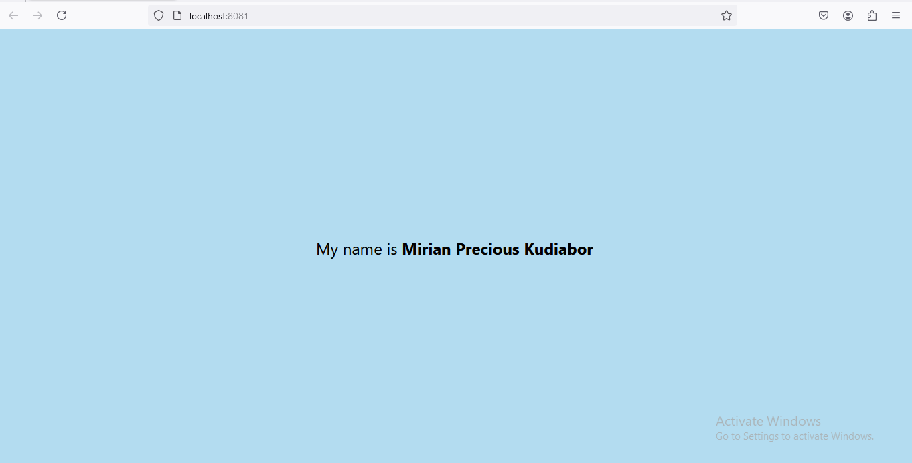

# Student ID: 11133878

# Task

This task involved modifying the default `App.js` to change the background color, display personalized text, and format it accordingly.

## Screenshot

## Task Description

- Changed the background color of the View component.
- Edited the Text component to display "My name is YourName".
- Increased the font size of the text to 24.
- Made the name "YourName" bold.
